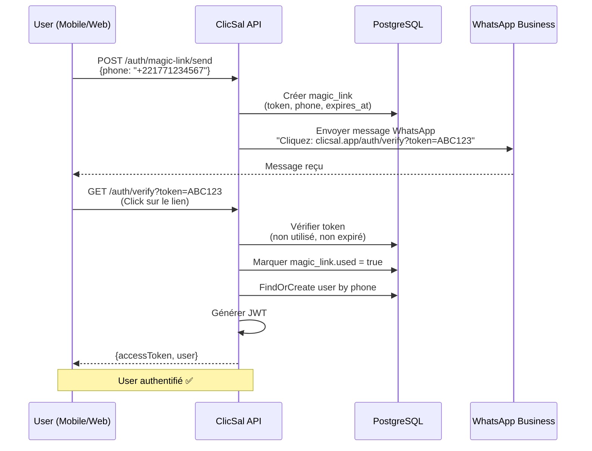
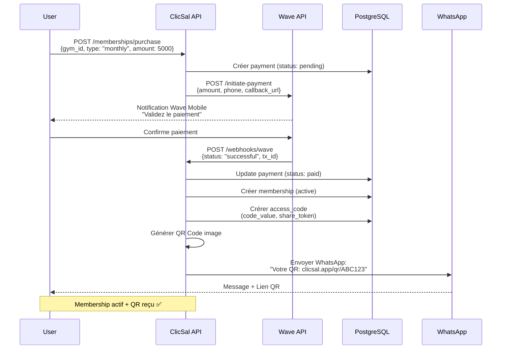
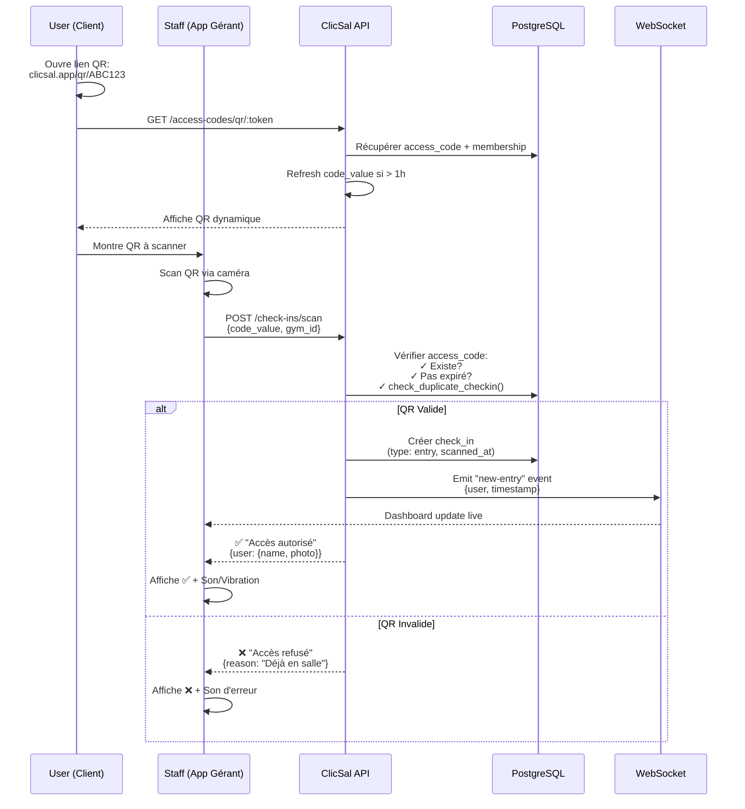
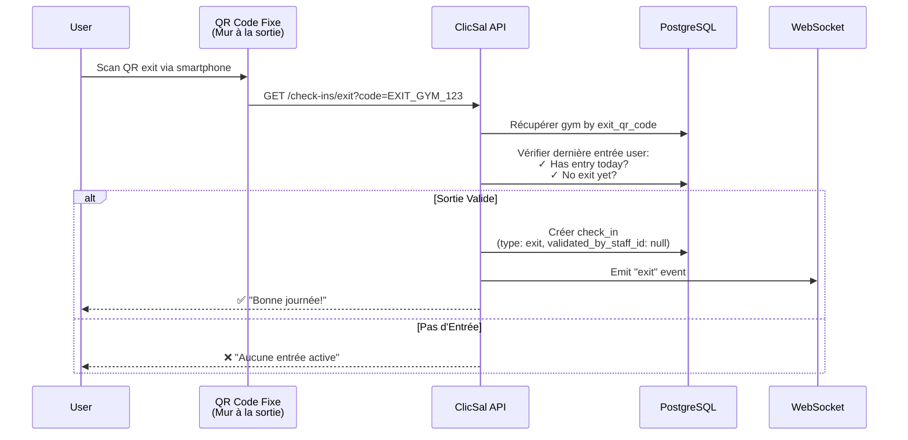
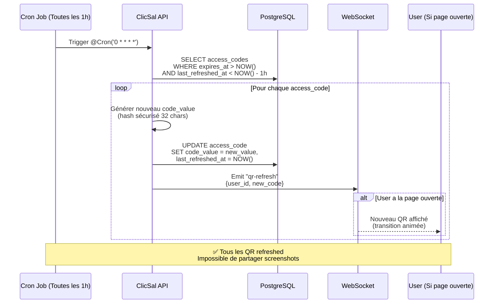
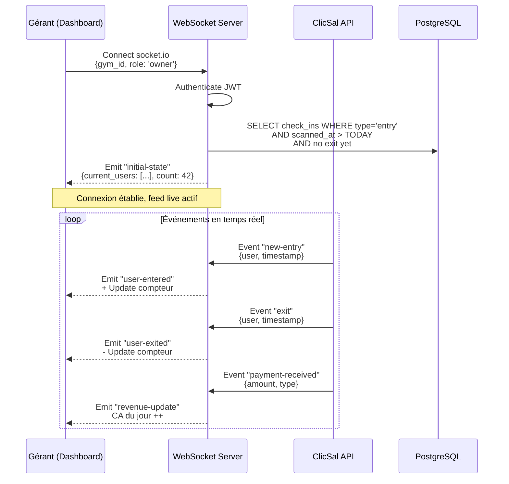
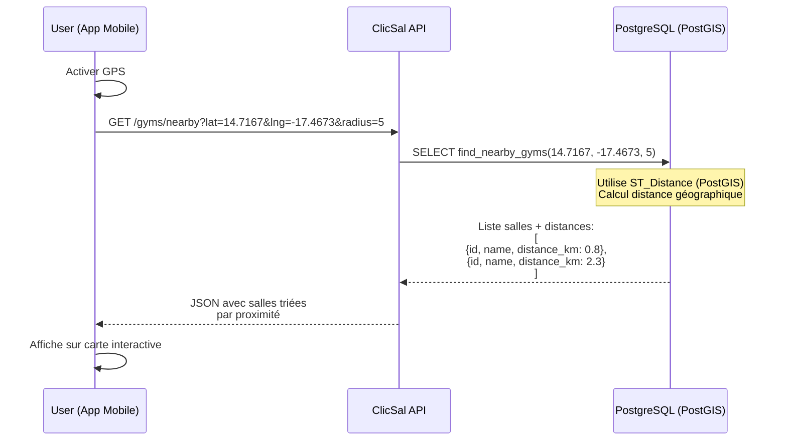
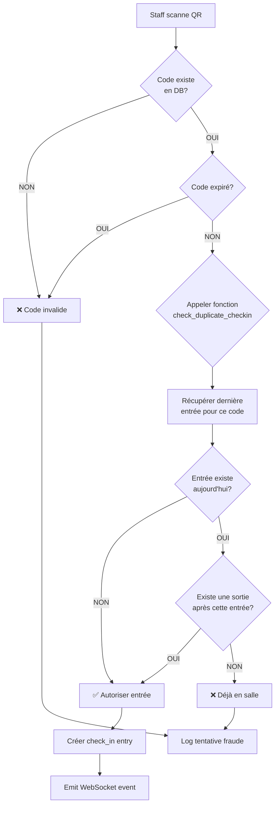
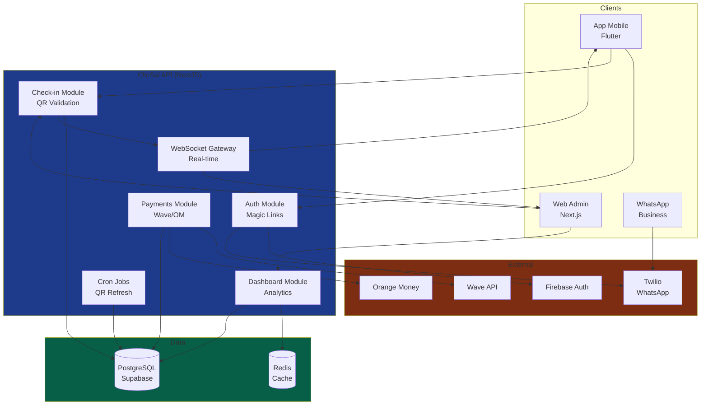

# 📊 Workflows ClicSal - Diagrammes Techniques

## 🌿 Workflow Git - Développement avec `develop` branch

### Stratégie de Branches

**`main`** : Branche de production, toujours stable
- ✅ Code testé et validé
- ✅ Prêt pour déploiement
- ❌ Pas de commits directs

**`develop`** : Branche de développement active
- ✅ Nouvelles features
- ✅ Fixes et améliorations
- ✅ Tests en cours
- ✅ Commits fréquents autorisés

### Flux de Travail

```bash
# 1. Créer/Basculer sur develop
git checkout develop
# Si develop n'existe pas encore localement:
git checkout -b develop

# 2. Développer une nouvelle feature
# Créer une branche feature depuis develop (optionnel pour grandes features)
git checkout -b feature/checkins-module

# 3. Faire vos modifications
# ... éditer des fichiers ...

# 4. Committer régulièrement
git add .
git commit -m "feat: add check-ins validation logic"

# 5. Pousser vers GitHub
git push origin develop
# Pour une branche feature:
git push origin feature/checkins-module

# 6. Quand la feature est stable et testée
git checkout develop
git merge feature/checkins-module

# 7. Merger dans main (quand prêt pour production)
git checkout main
git merge develop
git push origin main

# 8. Retourner sur develop pour continuer le développement
git checkout develop
```

### Conventions de Commits

```
feat:     Nouvelle fonctionnalité
fix:      Correction de bug
refactor: Refactoring sans changement de comportement
docs:     Documentation uniquement
style:    Formatage, points-virgules manquants, etc.
test:     Ajout de tests
chore:    Maintenance, dépendances, config
```

**Exemples** :
```bash
git commit -m "feat: add QR code auto-refresh cron job"
git commit -m "fix: prevent duplicate check-in entries"
git commit -m "docs: update DATABASE_SETUP.md with pgAdmin steps"
git commit -m "refactor: optimize getCurrentlyInGym query"
```

### Pull Requests (Recommandé pour équipes)

```bash
# 1. Pousser votre branche feature
git push origin feature/ma-feature

# 2. Sur GitHub: Créer Pull Request
#    feature/ma-feature → develop

# 3. Review du code par l'équipe

# 4. Merge via GitHub interface

# 5. Supprimer la branche feature
git branch -d feature/ma-feature
git push origin --delete feature/ma-feature
```

---

## 🔐 Workflow Authentification Magic Link



---

## 💳 Workflow Paiement & Génération QR Code



---

## ✅ Workflow Check-in Entrée (Validation Staff)



---

## 🚪 Workflow Check-in Sortie (Auto-Validation)



---

## 🔄 Workflow Refresh QR Code (Cron Job)



---

## 📊 Workflow Dashboard Live Feed (WebSocket)



---

## 🗺️ Workflow Géolocalisation Salles à Proximité



---

## 🔐 Sécurité Anti-Fraude (Check-in Duplicate)



---

## 📈 Architecture Globale du Système



---

## 🎯 Métriques de Performance Cibles

| Opération | Target | Critique |
|-----------|--------|----------|
| Check-in scan validation | < 500ms | ✅ Oui |
| QR code generation | < 200ms | ✅ Oui |
| Magic Link send (WhatsApp) | < 2s | ⚠️ Moyen |
| WebSocket event propagation | < 100ms | ✅ Oui |
| Dashboard initial load | < 1s | ⚠️ Moyen |
| Payment webhook processing | < 500ms | ✅ Oui |

---

## 📞 Contact & Support

Pour toute question sur ces workflows, contactez l'équipe technique : **dev@clicsal.app**
